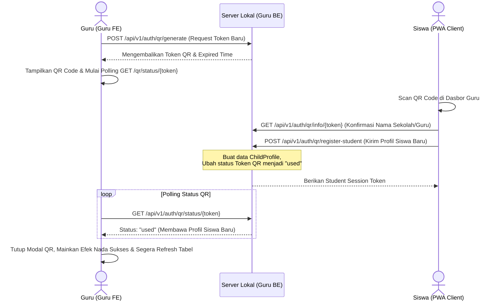

# 👨‍🏫 Portal Guru - DyLeks (DYLEKS-GURU)

Portal Guru adalah pusat kendali dan dasbor analitik kelas luring yang digunakan oleh guru untuk mengawasi, mendiagnosis, memantau riwayat latihan, serta mendapatkan rekomendasi rencana belajar taktis (*Teacher's AI Copilot*) bagi anak-anak disleksia.

Modul ini beroperasi secara penuh di server lokal laptop guru, memfasilitasi integrasi data siswa dari portal PWA tanpa memerlukan koneksi internet aktif.

---

## 🧭 Diagram Pendaftaran Mandiri Siswa (QR Code Flow)



---

## 📁 Struktur Direktori Portal Guru

```
Guru/
├── BE/                           # Backend Server (FastAPI)
│   ├── app/
│   │   ├── api/v1/               # Router Endpoints (auth.py, qr_connect.py, etc.)
│   │   ├── core/                 # Konfigurasi Database & Security
│   │   ├── models/               # Model ORM SQLAlchemy (child_profile.py, qr_token.py, dll.)
│   │   ├── schemas/              # Validasi Pydantic (user_schema.py, learning_schema.py)
│   │   ├── services/             # Copilot RAG, Audio Generator, Hardware Diagnostic
│   │   ├── config.py             # Pengaturan Variabel Lingkungan
│   │   └── main.py               # Entrypoint Utama Backend & Auto-Migration
│   ├── tests/                    # Unit Test Backend
│   ├── Dockerfile                # Deployment Container
│   ├── requirements.txt          # Dependensi Python
│   └── wsgi.py                   # Runner WSGI
│
└── FE/                           # Frontend Client (Next.js Dashboard)
    ├── components/               # Komponen UI (Mascots, ThemeToggle)
    ├── contexts/                 # Context API (ThemeContext)
    ├── pages/                    # Halaman Next.js (index.tsx, dll.)
    ├── public/                   # Aset Statis
    ├── styles/                   # File CSS Vanilla
    └── package.json              # Dependensi Node.js
```

---

## 🛠️ Cara Kerja Sistem (Deep-Dive Technical Mechanics)

### 1. QR Code Connection & Pendaftaran Mandiri Siswa
Untuk mengurangi beban administrasi guru dalam memasukkan profil siswa secara manual, DyLeks mengimplementasikan alur pendaftaran mandiri nirkabel luring:
*   **Token QR Sekali Paki:** Guru meng-klik tombol "Daftarkan Siswa Baru" di dasbor. FE Guru mengirimkan permintaan ke BE Guru untuk generate token UUID sekali pakai yang disimpan ke tabel `qr_tokens` dengan waktu kedaluwarsa 5 menit.
*   **Penyajian QR:** FE Guru me-render token tersebut ke dalam SVG QR Code (`qrcode.react`).
*   **Deteksi Selesai:** FE Guru memulai polling HTTP GET `/api/v1/auth/qr/status/{token}` setiap 3 detik. Begitu HP siswa melakukan pemindaian (scan) dan mengirimkan data pendaftaran siswa, status token di database berubah menjadi `used`. Respons polling mengembalikan profil lengkap siswa yang baru terdaftar, memicu dasbor guru untuk memainkan nada sukses, menutup modal QR, dan me-refresh tabel data siswa secara instan.

### 2. Deteksi Keaktifan Real-Time & Polling Heartbeat
*   **Heartbeat Ping:** PWA HP siswa secara berkala mengirimkan request POST ke backend `/api/v1/auth/heartbeat?child_id=<childId>` setiap 5 detik. Penulisan timestamp `last_seen` dilakukan ke database SQLite bersama `dyleks_shared.db`.
*   **Status Online (Glowing Green Indicator):** Dasbor Guru melakukan polling data daftar siswa dan feed aktivitas setiap 4 detik. Dasbor memeriksa keaktifan siswa menggunakan utilitas:
    ```typescript
    const isOnline = (lastSeenStr: string | null) => {
      if (!lastSeenStr) return false;
      const lastSeen = new Date(lastSeenStr);
      const now = new Date();
      return (now.getTime() - lastSeen.getTime()) < 15000;
    };
    ```
    Jika selisih waktu `last_seen` dengan waktu server kurang dari 15 detik, indikator bulatan hijau menyala (*glowing*) di samping nama siswa tersebut pada tabel. Jika lebih dari 15 detik, bulatan berubah warna menjadi abu-abu redup (offline).

### 3. Widget Feed Aktivitas Kelas Luring
*   Dasbor Guru memuat panel widget live-feed di bagian atas halaman utama.
*   Widget ini memanggil endpoint `/api/v1/auth/dashboard-feed` setiap 4 detik.
*   **Konstruksi Data Feed:** Backend mengompilasi aktivitas dari database secara dinamis:
    1.  Pendaftaran QR Siswa baru (dari tabel `child_profiles`).
    2.  Pengerjaan skrining yang baru selesai (dari tabel `screening_sessions`).
    3.  Pengerjaan latihan adaptif harian yang baru dikerjakan (dari tabel `learning_sessions`).
*   Aktivitas diurutkan berdasarkan timestamp terbaru (limit 10 item). Hal ini memungkinkan guru memantau secara langsung siswa mana yang sedang mengerjakan soal, siapa yang baru selesai skrining, dan siapa yang baru bergabung ke kelas luring.

### 4. Teacher's AI Copilot & Orton-Gillingham RAG luring
*   Ketika guru mengklik salah satu profil siswa yang terdeteksi memiliki hambatan disleksia, dasbor memuat riwayat kesalahan spesifiknya.
*   **Retrieval-Augmented Generation (RAG):** Backend membaca pola kesalahan dominan siswa (misal: inversi huruf `b` dan `d` dengan akurasi rendah).
*   Sistem mencari dokumen metode intervensi taktis multisensori Orton-Gillingham di folder lokal `app/data/`.
*   Dokumen relevan digabungkan ke dalam prompt dan dikirimkan ke model LLM lokal (Ollama `qwen2:1.5b`) untuk menghasilkan rekomendasi strategi mengajar yang personal, taktis, dan terfokus secara instan tanpa membutuhkan koneksi internet.

---

## ⚙️ Cara Menjalankan Layanan Secara Manual

### 1. Jalankan Backend (Guru BE)
*   **Port Default:** `3006`
*   **Langkah-langkah:**
    ```powershell
    cd BE
    # Membuat Virtual Environment
    python -m venv venv
    venv\Scripts\activate
    # Menginstal dependensi
    pip install -r requirements.txt
    # Menjalankan server
    python -m uvicorn app.main:app --host 0.0.0.0 --port 3006 --reload
    ```

### 2. Jalankan Frontend (Guru FE)
*   **Port Default:** `3005`
*   **Langkah-langkah:**
    ```powershell
    cd FE
    # Menginstal dependensi Node
    npm install
    # Menjalankan Next.js development server di port 3005
    npm run dev -- -p 3005
    ```
