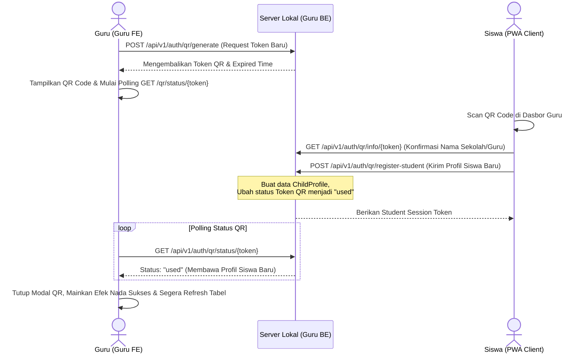

# 👨‍🏫 Portal Guru - DyLeks (DYLEKS-GURU)

Portal Guru adalah modul dasbor analitik bagi guru/tenaga pendidik untuk memantau, mendiagnosis, dan merumuskan intervensi belajar (Orton-Gillingham) bagi anak-anak disleksia. Modul ini didukung oleh AI Copilot untuk menyusun strategi belajar yang disesuaikan secara personal per-siswa.

---

## 🧭 Diagram Pendaftaran Mandiri Siswa (QR Code Connection Flow)

Berikut adalah diagram alur bagaimana siswa mendaftarkan diri secara mandiri tanpa input manual dari guru, memanfaatkan token QR sekali pakai:



---

## 📊 Fitur Utama Portal Guru

1.  **Dasbor Analitik Progres Belajar:**
    *   **Metrik Rata-rata Akurasi:** Persentase keseluruhan ketepatan ejaan siswa dalam latihan.
    *   **Deteksi Pola Kesalahan Dominan:** Menganalisis log TrOCR dan latihan adaptif secara cerdas untuk memetakan jenis kesalahan anak (apakah mengalami Inversi Spasial `b/d/p/q` atau Phonological Omission/Substitusi).
    *   **Tabel Riwayat Sesi Detail:** Log pengerjaan lengkap siswa yang memuat: tanggal pengerjaan, skor akurasi, durasi sesi, dan detail per-kata yang salah dijawab.
2.  **Pendaftaran Mandiri Siswa (QR Code):**
    *   Mengurangi beban administrasi guru dengan sistem scan QR Code sekali pakai untuk pendaftaran profil siswa.
3.  **AI Copilot (Orton-Gillingham Intervention):**
    *   Sistem RAG (Retrieval-Augmented Generation) luring memanfaatkan LLM lokal untuk menghasilkan rekomendasi teknik mengajar multi-sensori Orton-Gillingham berdasarkan data riwayat kesalahan spesifik siswa.
4.  **Optimalisasi Dasbor & Deteksi Real-Time:**
    *   Tampilan indikator status koneksi siswa secara real-time (glowing green dot) berdasarkan data `last_seen` dari ping heartbeat siswa.
    *   Panel Widget "Feed Aktivitas Kelas Luring" untuk memantau pendaftaran siswa baru, penyelesaian skrining, dan sesi latihan siswa secara live menggunakan auto-polling interval 4 detik.

---

## ⚙️ Panduan Menjalankan Layanan Lokal

Portal Guru terdiri dari komponen Frontend dan Backend. Untuk menjalankannya secara lokal:

### 1. Backend (Guru BE)
*   **Port Default:** `3006`
*   **Prasyarat:** Python 3.12, menginstal `requirements.txt`.
*   **Cara Menjalankan:**
    ```bash
    cd BE
    pip install -r requirements.txt
    python -m uvicorn app.main:app --host 0.0.0.0 --port 3006
    ```

### 2. Frontend (Guru FE)
*   **Port Default:** `3005`
*   **Prasyarat:** Node.js 18+.
*   **Cara Menjalankan:**
    ```bash
    cd FE
    npm install
    npm run dev -- -p 3005
    ```
